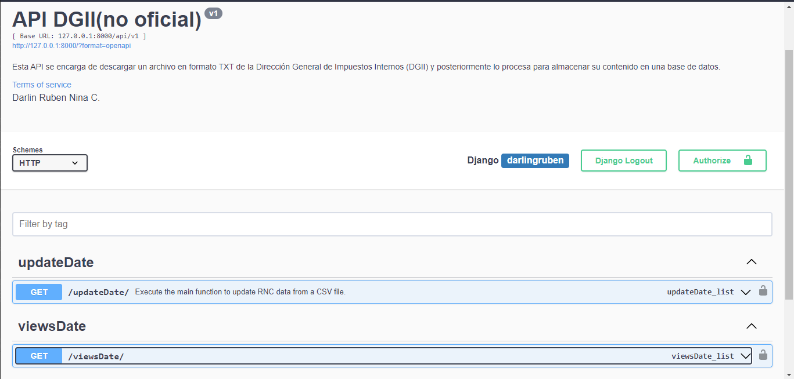

# API_DGII
<h2>4.2.6</h2>

Esta API se encarga de descargar un archivo en formato TXT de la Dirección General de Impuestos Internos (DGII) y posteriormente lo procesa para almacenar su contenido en una base de datos.

## Uso

### Instalación
Sigue estos pasos para configurar y arrancar el proyecto:

1. **Instalar las dependencias desde el archivo `requirements.txt` con pip**:

    ```bash
    pip install -r requirements.txt
    ```

2. **Crear migraciones para la base de datos**:

    Para configurar la base de datos, primero crea las migraciones:

    ```bash
    python manage.py makemigrations
    ```

    Luego, aplica las migraciones:

    ```bash
    python manage.py migrate
    ```

3. **Iniciar el servidor de desarrollo**:

    Para arrancar el proyecto, utiliza el siguiente comando:

    ```bash
    python manage.py runserver
    ```

### Descripción
Esta API se encarga de descargar un archivo en formato TXT de la Dirección General de Impuestos Internos (DGII) y posteriormente lo procesa para almacenar su contenido en una base de datos.

<hr>

## Sitio web
Visita el sitio web de la API DGII (no oficial) en [https://api-dgii.onrender.com/](https://api-dgii.onrender.com/).


